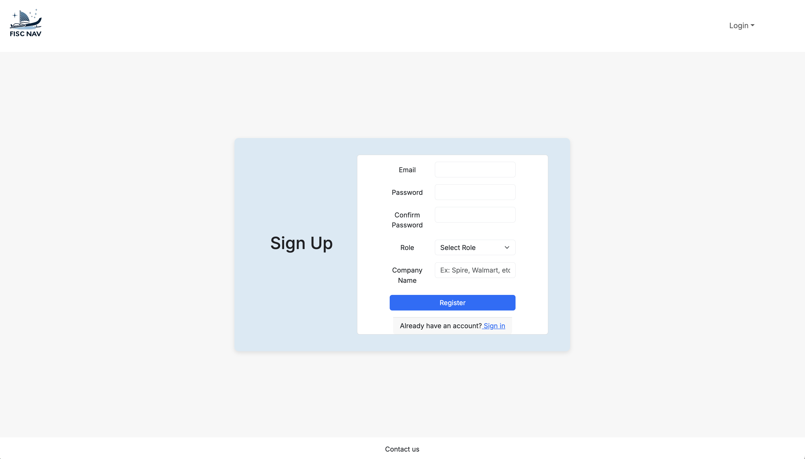
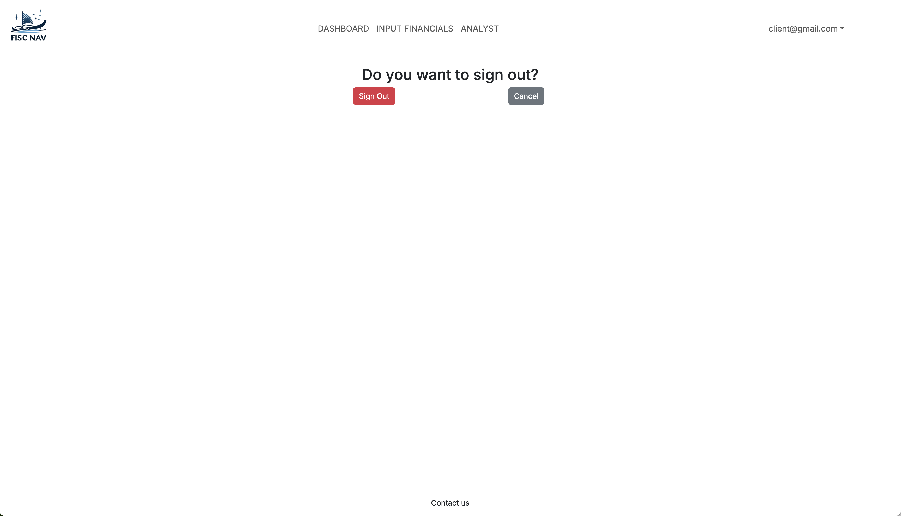
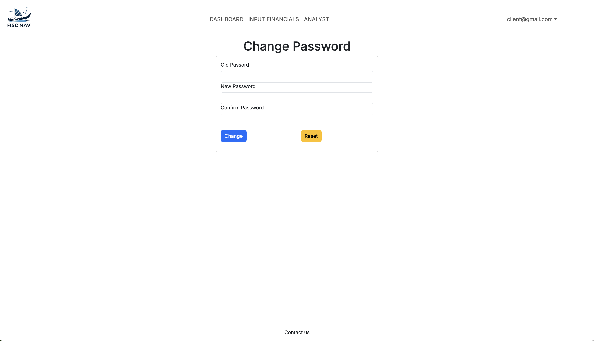

# Team Tres

## Table of contents

- [Overview](#overview)
- [Our Goals](#our-goals)
- [User Guide](#user-guide)
- [Project Management Links](#project-management-links)
- [Team Profiles](#team-profiles)
- [Team Contract](#team-contract-click-on-me)

## Overview

Spire is an independent accounting and strategic consulting firm that offers insight and solutions to an organization's most difficult problems. Our small engagement teams, which are made up of seasoned strategists, accountants, marketers, developers, and designers, produce significant outcomes.

As we know. Spire has developed a financial sustainability model to help organizations make informed financial and strategic decisions by consolidating financial data and integrating nonfinancial factors. Built on Excel, the model features two key worksheets—the Financial Compilation (“FC”) and the FS Dashboard—linked through interconnected variables. While effective, Spire is interested in transitioning to a newer, more robust, and user-friendly software platform that leverages advanced technology and the creativity of student software engineers. Additional features may be introduced later as this transition progresses.

## Our Goals

We are a team of eight computer science students from UH Manoa, dedicated to transforming Spire Hawaii's financial sustainability model into a user-friendly web application. Throughout the semester, we will collaborate with Spire through regular milestones meetings, gathering feedback and updating the application to align with their needs and requests. Our aim is to deliver a robust and accessible platform that integrates advanced technology while meeting Spire's goals for enhanced usability and functionality.

## User Guide
### Landing Page

  
  

    This is the first page users see on the application.
  

### Sign-Up Page

  
  

    This page allows clients to sign up for an account by inputing their email, password, their role, and the company they are associated with.
  

### Sign-In Page

  
  

    On this page, users can sign in to their account by inputing their email and password.
  

### Sign-Out Page

  
  

    Users can sign out of their account by clicking the sign out button.
  

### Change Password Page

  
  

    Users may change their password once they log into their account. They can do this by inputing their old and new password.
  

### About Page

  
  
  

    The about page can be navigated to by clicking "About us" in the footer. On this page user can read about the mission of the application and how it works.
  

### CLient Dashboard

  
  

    The client dashboard is accessible exclusively to users with a client role. It provides a centralized hub where users can manage their account settings, review their account summary, and gain insights into their company's sustainability model, stress tests, and forecasts.
  

### Analyst Dashboard

  
  

    The analyst dashboard can only be seen by users with an analyst role. On this page the user can create and view existing workpapers, scenarios, forecasts, and stress tests. 
  

### Input Finacial Information Page

  
  
  

    This page allows users exclusively with an auditor role to input finacial information for a company.
  

## Project Management Links
- [Milestone 1](https://github.com/orgs/team-tres/projects/1)
- [Milestone 2](https://github.com/orgs/team-tres/projects/4)
- [Milestone 3](https://github.com/orgs/team-tres/projects/5)

## Team Profiles

### Frontend Team
<table class = "team-profile">
  <tr>
    <td align="center">
      
       
      <a href="https://ethvnchristman.github.io/">Ethan Christman</a>
    </td>
    <td align="center">
      
       
      <a href="https://tatumumi.github.io/">Tatum Umiamaka</a>
    </td>
    <td align="center">
      
       
      <a href="https://kyj1n.github.io/">Jayrell Allen Ballesteros</a>
    </td>
    <td align="center">
      
       
       <a href="https://Senyr.github.io/">Ryne Stagen</a>
    </td>
  </tr>
</table>

### Backend Team
<table class = "team-profile">
  <tr>
    <td align="center">
      
       
      <a href="https://github.com/PhatCa">Phat Ca</a>
    </td>
    <td align="center">
      
       
      <a href="https://jaydenontalancapistrano.github.io/">Jayden Ontalan Capistrano</a>
    </td>
    <td align="center">
      
       
      <a href="https://ronanandal.github.io/">Ronan Russel Andal</a>
    </td>
    <td align="center">
      
       
      <a href="https://hbireley.github.io/">Hayden Bireley</a>
    </td>
  </tr>
</table>

## [Team Contract (Click on me!)](https://docs.google.com/document/d/1PtK9j9zk-jefk0_NDozeijfspRGjd_3e9DQLcb-CBsA/edit?usp=sharing)
